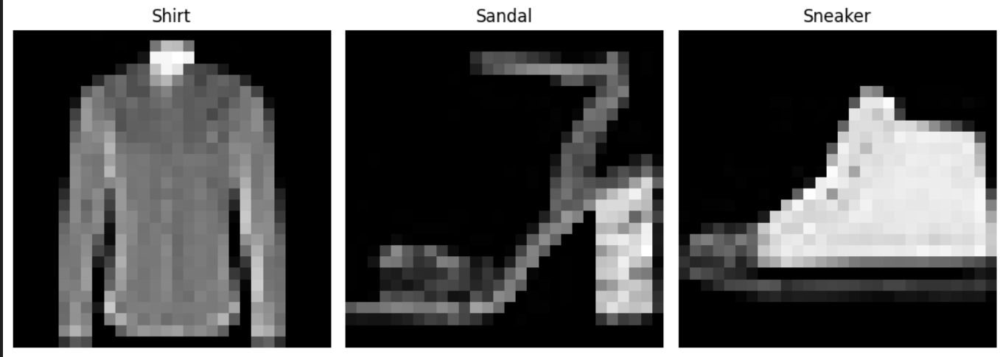
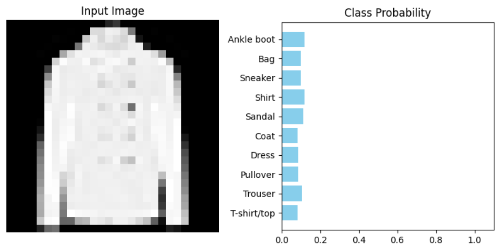
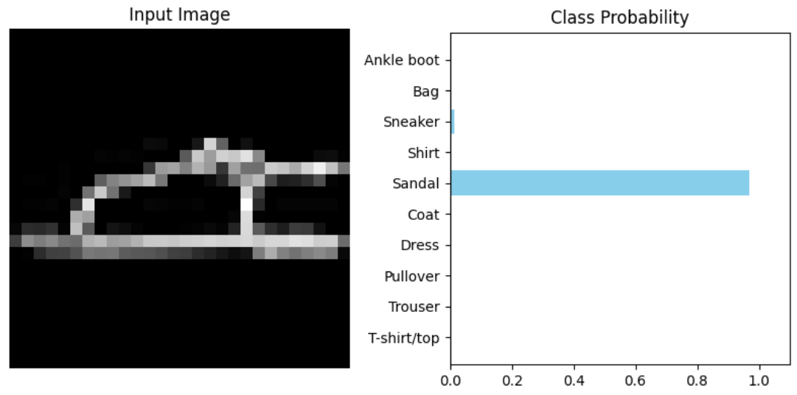
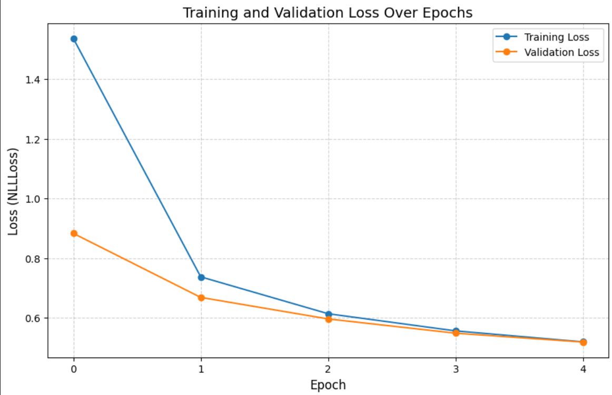
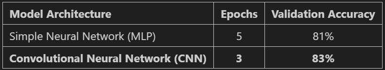

# FashionMNIST Image Classification 🎯
🧥 Deep Learning models for Fashion-MNIST classification implemented in PyTorch, featuring both Neural Network (NN) and Convolutional Neural Network (CNN) architectures


## Table of Contents  

1. [About](#about)  
2. [Features](#features)  
3. [Requirements](#requirements)  
4. [Installation](#installation)  
5. [Usage](#usage)  

---

## About

The **FashionMNIST Image Classification** project is a comprehensive exploration of deep learning architectures for computer vision. Using the **Fashion-MNIST dataset**—a modern replacement for the classic MNIST digits—this project implements, trains, and compares two distinct types of neural networks using **PyTorch**.

The core objective is to demonstrate the evolution of image recognition techniques:
1.  **Multi-Layer Perceptron (MLP)**: A classic feed-forward neural network that treats images as flattened vectors of pixels.
2.  **Convolutional Neural Network (CNN)**: A specialized architecture that preserves the spatial structure of images, using convolutional layers to automatically detect features like edges, textures, and shapes.

By comparing these two models, the project highlights why CNNs have become the industry standard for image-related tasks, showing significant improvements in both training efficiency and classification accuracy.


---

## Features

- **Dual Architecture Implementation**: Includes both a standard Multi-Layer Perceptron (MLP) and a Convolutional Neural Network (CNN) for comparative performance analysis.
- **End-to-End PyTorch Workflow**: A complete pipeline featuring data loading, preprocessing (normalization), model definition, training, and validation.
- **Hardware Acceleration**: Automatic GPU/CPU detection to ensure efficient training using CUDA when available.
- **Automated Data Pipeline**: Custom data loaders with automated splitting of the Fashion-MNIST dataset into Training and Validation sets.
- **Dynamic Training Loop**: A robust training function that tracks loss and accuracy metrics in real-time across epochs.
- **Advanced Feature Extraction**: CNN implementation featuring 2D convolutional layers, max-pooling for dimensionality reduction, and Log-Softmax activation for multi-class classification.
- **Performance Visualization**: Includes comparative tables and analysis that highlight the superior efficiency and spatial awareness of the CNN architecture.
- **Modular Codebase**: Clean and reusable functions for training and evaluation, making it easy to experiment with different hyperparameters.

---
## Requirements

- **Python 3.x**: The core programming language.
- **PyTorch**: The primary deep learning framework used for building and training the neural networks.
- **Torchvision**: Used for accessing the Fashion-MNIST dataset and performing image transformations.
- **Jupyter Notebook environment**: VS Code (with Jupyter extension), JupyterLab, or Google Colab.
- **Matplotlib**: For plotting training loss curves and visualizing dataset samples.
- **NumPy**: For numerical operations and data manipulation.
- **Git**: To clone the repository.

---
## Installation

### 1. Clone the repository
```bash
git clone https://github.com/Amit-Bruhim/FashionMNIST-Image-Classification.git
```

### 2. Navigate into the project folder
```bash
cd FashionMNIST-Image-Classification
```

### 3. Install required libraries
```bash
pip install torch torchvision numpy matplotlib
```

### 4. Open and Run the Notebook
Open the file `src/fashion_mnist_classification.ipynb` using VS Code or upload it to Google Colab.  

You can then click **"Run All"** to execute the training and see the results.

*Tip: You don't have to run the code to see the results; you can simply scroll through the notebook to view the pre-saved outputs and graphs.*

---
---

## Usage

### 1. Data Exploration 🖼️
The project starts by loading and normalizing the Fashion-MNIST dataset. We visualize random samples from the training set to understand the 10 clothing categories (T-shirts, Trousers, Pullovers, Dresses, etc.).



### 2. Baseline: Random Guessing vs. Intelligent Model 📈
A crucial step in evaluating our models was establishing a baseline performance before any learning took place:
* **Initial State (Random Weights)**: Before training, the model's predictions were visualized, showing an accuracy of ~**10%**. This represents a **Uniform Probability** distribution, where the model essentially makes a random guess.
* **After Training**: After the optimization process, the model's accuracy jumped to **81%**, demonstrating that the network successfully learned to distinguish between complex clothing patterns.




### 3. Training & Convergence 📉
We track the training and validation loss for both architectures to ensure the models are converging and not overfitting. 



### 4. Final Performance Comparison 🏆
The project concludes with a direct comparison between the two models. Even with fewer training cycles (epochs), the CNN's superior architecture leads to better generalization and higher accuracy.




---